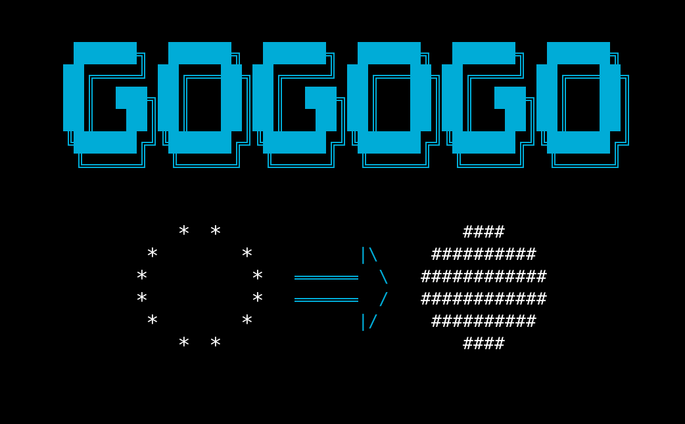
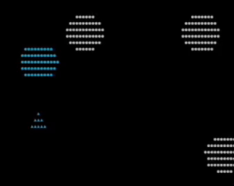
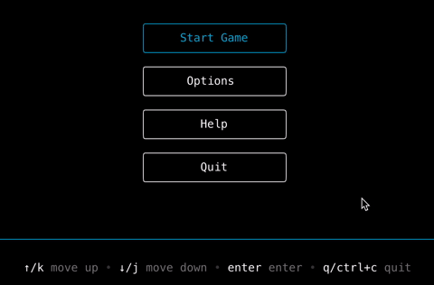
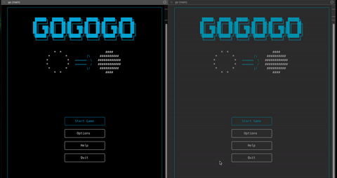
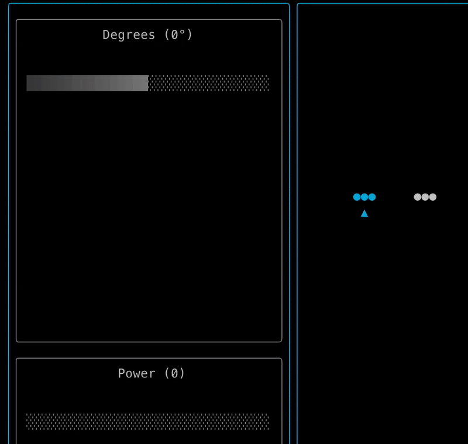
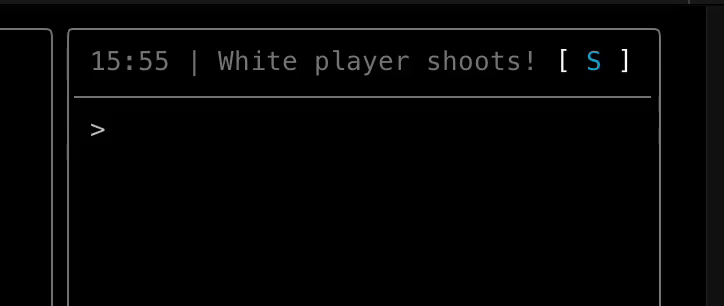
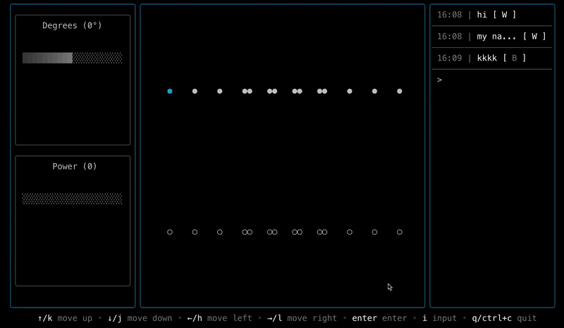

# Go-Go-Go

A full-stack multiplayer [Alkkagi (Stone-Shooting)](https://en.wikipedia.org/wiki/Alkkagi) game built entirely in Go, featuring a `terminal user interface (TUI)`, `real-time WebSocket communication` and `game history recording`.

## Table of Contents
- [Project Overview](#project-overview)
- [How to Play](#how-to-play)
- [Core Components](#core-components)

## Project Overview
### 🖥️ **Terminal User Interface (TUI)**
- **Modern TUI**: Built with [Bubble Tea](https://github.com/charmbracelet/bubbletea) framework for a gui-like experience in the terminal.
- **Real-time Rendering**: Render game state and animations by using handling custom animation logic.

### 🌐 **Real-time Multiplayer**
- **WebSocket Communication**: Instant game state synchronization by sending game events and animation by using [Gorilla WebSocket](https://github.com/gorilla/websocket).
- **Live Message System**: In-game messaging for player interaction. Messages include chat and game events.

### 🎮 **Game Mechanics**
- **Physics Engine**: Realistic stone collision and movement simulation with calculations for velocity and acceleration.
- **Relative Positioning**: Stones are positioned in game board (100x100) with relative coordinates and rendered in user's current terminal window size.

### 💾 **Recording History**
- **Game Records**: Automatic recording of all game sessions with saving the event history. ([postgreSQL](https://www.postgresql.org))

## How to Play
1. **Start**: Select the start menu to match with another player. Use arrow keys or `H`, `J`, `K`, `L` keys to navigate. (see below for help)

1. **Match**: Wait for another player to join your session. when both players are ready, the game starts automatically.

3. **Game**: Use arrow keys or `H`, `J`, `K`, `L` keys to navigate and **control** your shoot. Press `I` to **chat** with other player. You can **resize** the window to see the game board and stones in more detail.

4. **Win**: If one player has no more stones left, the game ends and exit with an announcement of the winner.

### Previews

#### ***Shoot***

#### ***Chat*** 

#### ***Resize***

## Core Components

>*We tried to build this project from scratch to understand basics of Go and how it can actually be used to build a real-world project. These are our main components of the project.*

- ***`Logging`***: Using [Slog](https://pkg.go.dev/log/slog), a structured logger for Go to debug our application to understand the game flow and debug issues.
- ***`Testing`***: We were fascinated by the Go's testing environment, which allows us to write more testable code and solve complex problems (like physics, UI rendering, etc.). We used [Require](https://pkg.go.dev/github.com/stretchr/testify/require) mostly for assertions.
- ***`Websocket`***: Using [Gorilla WebSocket](https://github.com/gorilla/websocket) for real-time communication, (Mostly followed the documentation and examples) which eventually lead us to understand goroutines and channels.
- ***`TUI`***: Using [Bubble Tea](https://github.com/charmbracelet/bubbletea) for a modern TUI framework Also used [Lipgloss](https://github.com/charmbracelet/lipgloss) for styling and [Bubbles](https://github.com/charmbracelet/bubbles) for UI components. We implemented our own custom UI layout components inspired by flutter widgets *(like Column, Row, FlexContainer)*.
- ***`Responsive UI`***: We converted the game board to UI elements using relative coordinates and rendered in user's current terminal window size. *(Try zoom in and out to see the difference!)*
- ***`Physics Simulation`***: Custom physics engine for realistic stone movement and collision detection. No external libraries used, just pure Go code. *(That's why we called this project "Go-Go-Go"!)*

### Future Plans
- Single-player mode with AI opponent
- User customization options (e.g., stone colors, board size)
- Special stone types (e.g., stones with special abilities)
- User Accounts and Authentication

### Contributors
- [@yanmoyy](https://github.com/yanmoyy)
- [@Gutssssssssss](https://github.com/Gutssssssssss)

### License
[MIT](./LICENSE)
